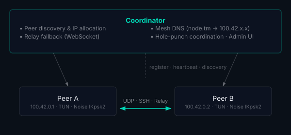

> [!WARNING]
> **Highly experimental**: Stable but still tightening bolts. Not for Production use.

# tunnelmesh

[](https://github.com/tunnelmesh/tunnelmesh/actions/workflows/ci.yml)
[](https://codecov.io/gh/tunnelmesh/tunnelmesh)
[](https://github.com/tunnelmesh/tunnelmesh/network/updates)
[](https://github.com/tunnelmesh/tunnelmesh/network/dependencies)

A peer-to-peer mesh networking tool that creates encrypted tunnels between nodes. tunnelmesh enables direct, secure
communication between peers in a distributed topology without requiring a traditional VPN or centralised traffic
routing.

## Features

- **P2P Encrypted Tunnels** - Direct connections between peers using pluggable transports
- **Coordinator Peers** - Admin peers that provide discovery, IP allocation, and NAT traversal coordination
- **Exit Peers** - Split-tunnel routing: route internet traffic through peers and keep mesh traffic direct
- **TUN Interface** - Virtual network interface for transparent IP routing
- **Built-in DNS** - Local resolver for mesh hostnames (e.g., `node.tunnelmesh` or `node.tm`)
- **Network Monitoring** - Automatic detection of network changes with re-connection
- **Pluggable Transport Layer** - Supports SSH, UDP, and WebSocket relay transports with fallback
- **NAT Traversal** - UDP hole-punching with STUN-like endpoint discovery, plus relay fallback
- **Multi-Platform** - Linux, macOS, and Windows support
- **Admin Dashboard** - Web UI for mesh status, peers, traffic statistics, and per-peer transport controls
- **Node Location Map** - Geographic visualisation of mesh peers
- **Unified Architecture** - All nodes are peers; coordinators are peers with admin services enabled
- **High Performance** - Zero-copy packet forwarding with lock-free routing table
- **Internal Packet Filter** - Port-based firewall with per-peer rules, configurable via config, CLI, or admin UI
- **S3 Compatible Storage** - Distributed and replicated across the mesh with erasure coding
- **Observability Baked-in** - Prometheus, Grafana and Loki integrated into Admin dashboard

## Architecture



**Key points:**
- **Unified Architecture**: All nodes are peers; coordinators are admin peers with services enabled
- Traffic flows directly between peers via encrypted tunnels — UDP (ChaCha20-Poly1305), SSH, or WebSocket relay with automatic fallback
- Coordinator peers handle discovery, registration, and NAT traversal coordination
- Peers behind NAT use hole-punching or relay as fallback

## Documentation

Full documentation is at **[read.tunnelmesh.io](https://read.tunnelmesh.io)**, covering:

- **[Quick Start Guide](https://read.tunnelmesh.io/docs/getting-started/)** — installation, setup, and first mesh
- **[Admin Guide](https://read.tunnelmesh.io/docs/admin/)** — coordinator config, admin interface, and mesh management
- **[User Identity & RBAC](https://read.tunnelmesh.io/docs/user-identity/)** — users, groups, and access control
- **[CLI Reference](https://read.tunnelmesh.io/docs/cli/)** — all commands, flags, and walkthroughs
- **[Docker Deployment](https://read.tunnelmesh.io/docs/docker/)** — containerised setup and multi-coordinator testing

## Docker Deployment

Run tunnelmesh in containers for development, testing, or production. The docker-compose setup includes **scalable coordinators** for testing chunk-level replication between multiple coordinator nodes. See the **[Docker Deployment Guide](https://read.tunnelmesh.io/docs/docker/)** for complete documentation.

```bash
cd docker
docker compose up -d                         # Start with 2 coordinators (default)
docker compose up -d --scale coordinator=3   # Scale to 3 coordinators
make docker-logs-coords                      # View coordinator logs
make docker-test                             # Run connectivity tests
```

**Multi-coordinator features:**
- Coordinators discover each other via peer registration (no primary/replica distinction)
- S3 chunks replicated peer-to-peer based on per-bucket replication factors
- Each coordinator runs its own monitoring stack (Prometheus/Grafana/Loki)
- Ephemeral storage (tmpfs) for testing - data resets on restart
- Easy scaling for replication testing: `make docker-scale-coords`

## Cloud Deployment

Deploy to DigitalOcean App Platform with Terraform. See the **[Cloud Deployment Guide](https://read.tunnelmesh.io/docs/cloud-deployment/)** for
complete documentation.

```bash
cd terraform
cp terraform.tfvars.example terraform.tfvars
export TF_VAR_do_token="dop_v1_xxx"
terraform init && terraform apply
```

## Development

### Running Tests

```bash
make test           # Run tests
make test-verbose   # Verbose output
make test-coverage  # With coverage report
```

### Code Quality

```bash
make lint  # Run golangci-lint
make fmt   # Format code
```

### Development Servers

```bash
make dev-server  # Build and run server
make dev-peer    # Build and run peer (with sudo)
```

## License

GNU Affero General Public License v3.0 - see [LICENSE](LICENSE) for details.
